# Diseña lo que imagines en 3D con TINKERCAD

Este es un completo curso de TINKERCAD y una colección de ejercicios para practicar

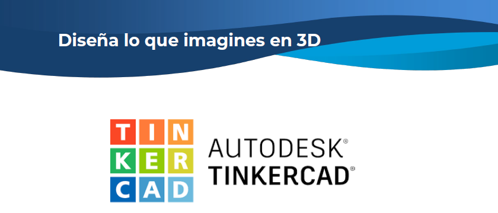

<a rel="Curso en PDF" href="Dise%C3%B1a%20lo%20que%20imagines%20en%203D.pdf">

# Ejercicios

## 1 Spinner
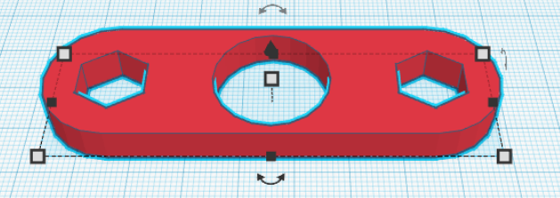 | 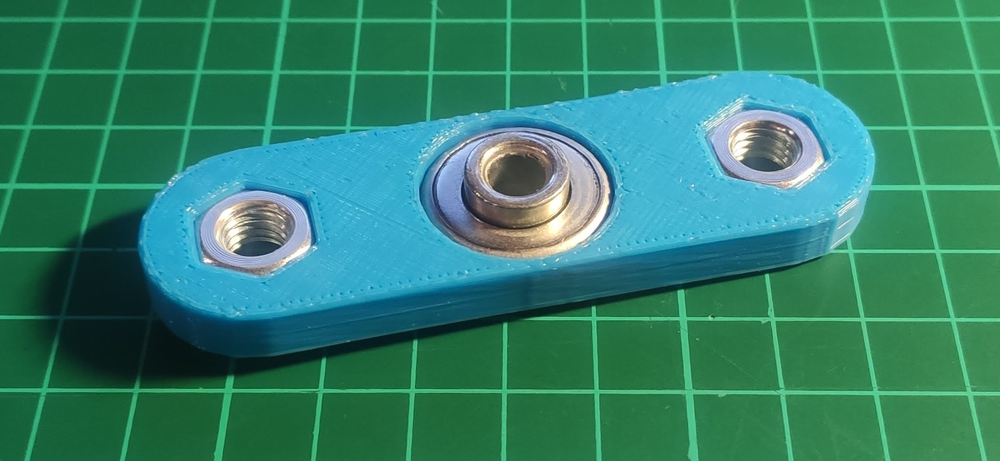
:-------------: | :-------------:
## 2 Bola enjaulada
 | 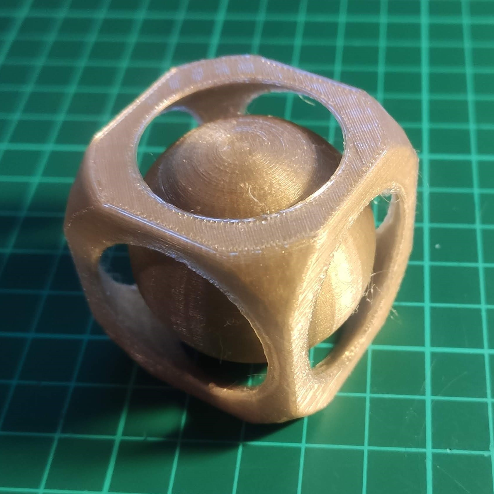
:-------------: | :-------------:
## 3 Silla
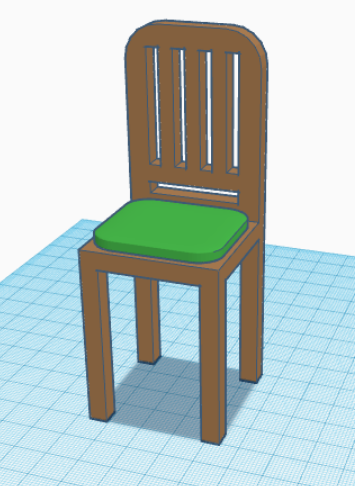 | 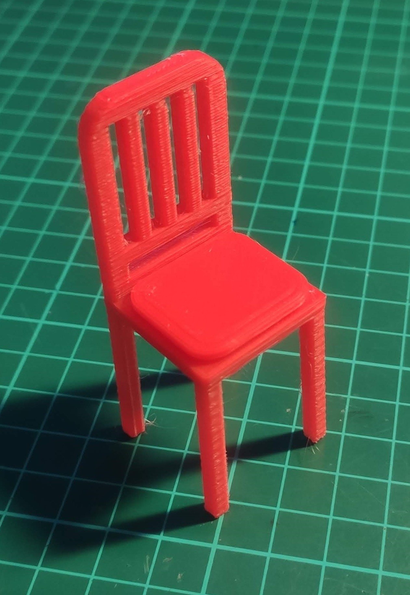
:-------------: | :-------------:
## 4 Castillo
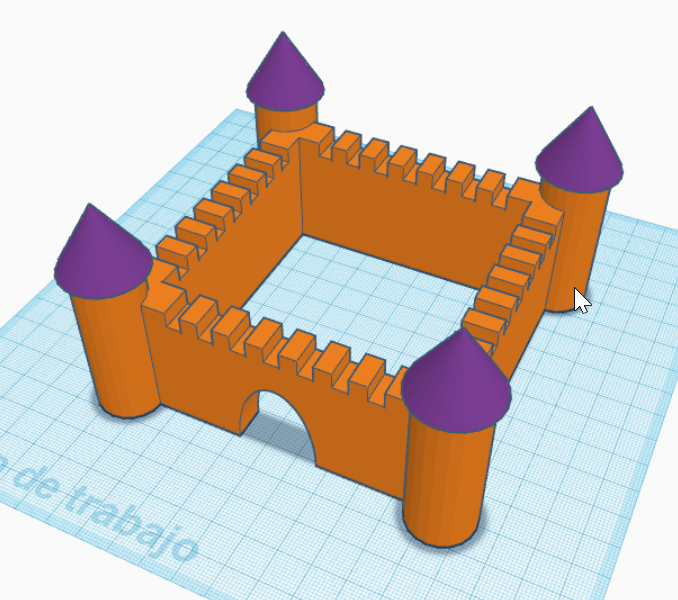 | 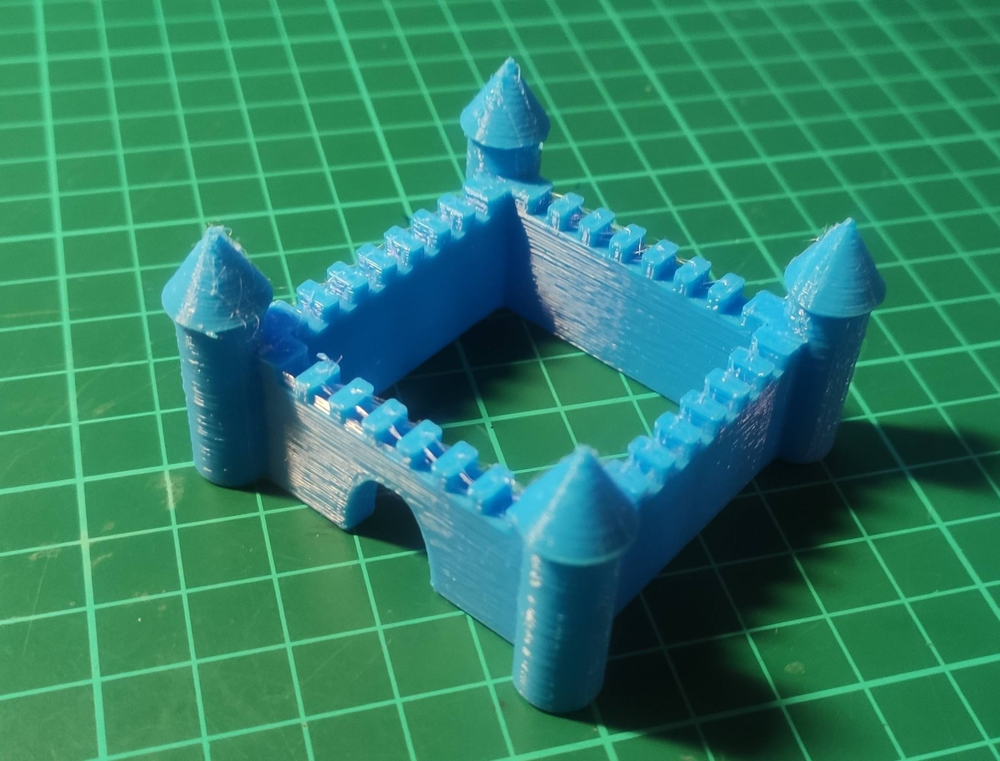
:-------------: | :-------------:
## 5 Empire State Building 
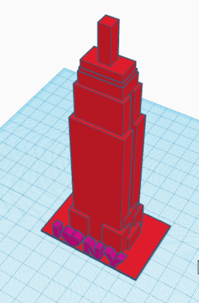 | 
:-------------: | :-------------:
## 6 Cubilete para lápices
 | 
:-------------: | :-------------:
## 7 Torre Eiffel
 | 
:-------------: | :-------------:
## 8 Torre de Pisa
 | 
:-------------: | :-------------:
## 9 Taza
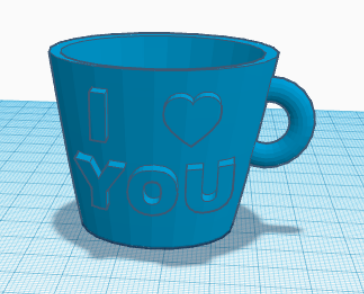 | 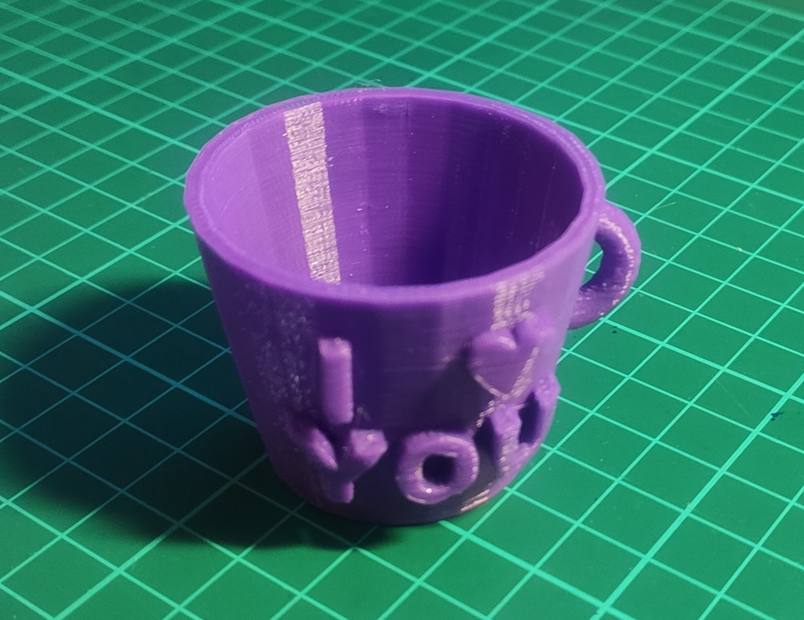
:-------------: | :-------------:
## 10 Parthenon
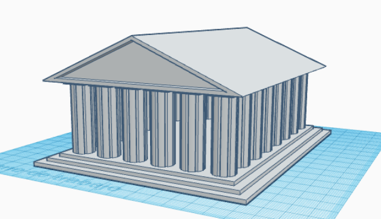 | 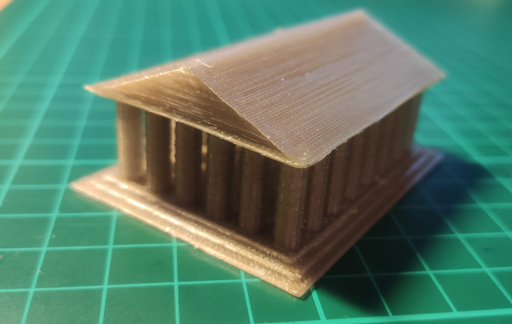
:-------------: | :-------------:
    
# Licencia

 **Diseña lo que imagines en 3D con TINKERCAD** creado por **Juan Pedro Perianes Rodríguez** se distribuye bajo una <a rel="license" href="http://creativecommons.org/licenses/by-sa/4.0/">Licencia Creative Commons Atribución-CompartirIgual 4.0 Internacional</a>.

# Agradecimientos
Agradezco a las siguientes personas sus diseños que me han servido de inspiración:
* Javier Sanz Leyva
* Oscar Robledo
* Sara García
* Korean Eunny
